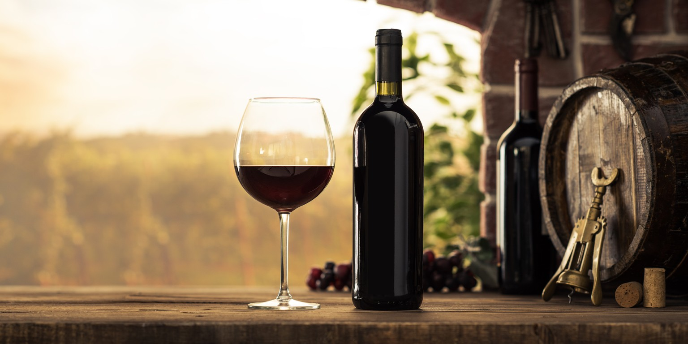
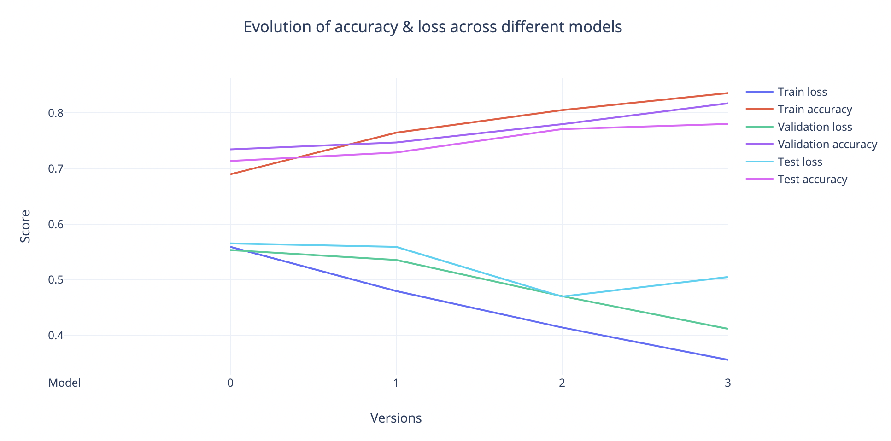
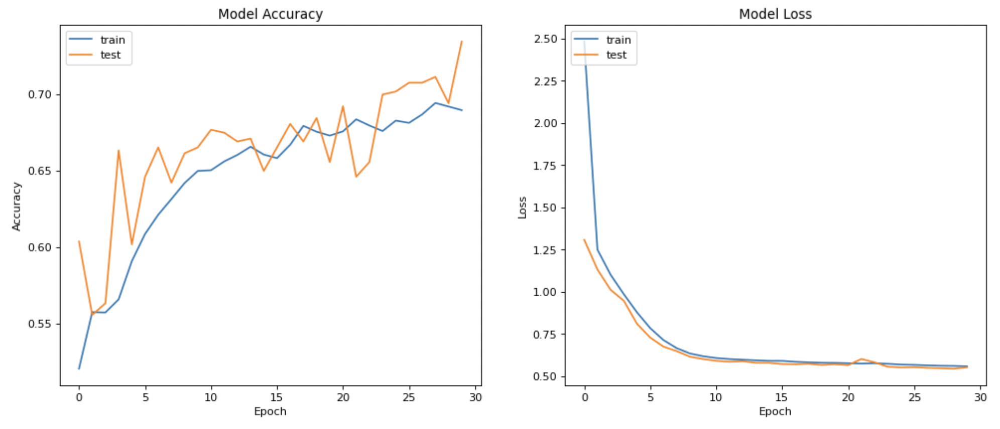
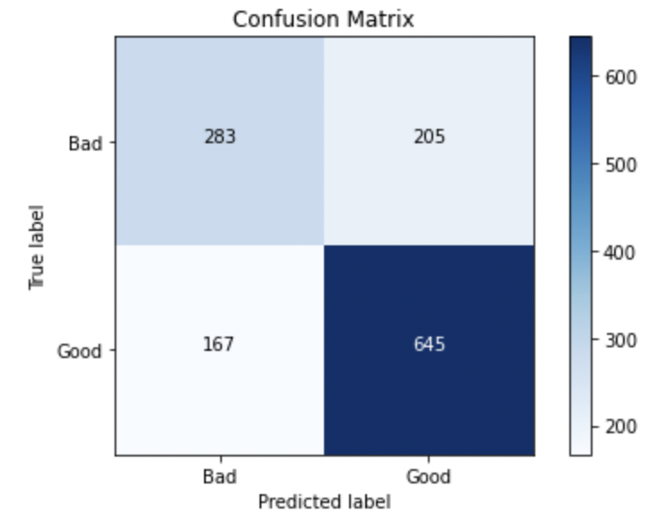
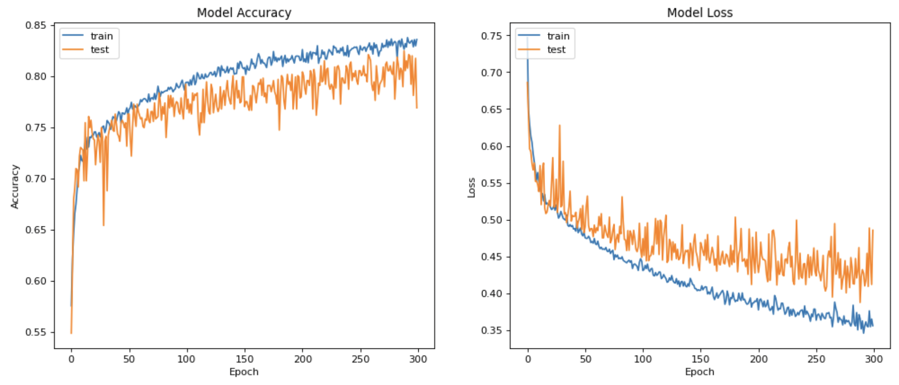
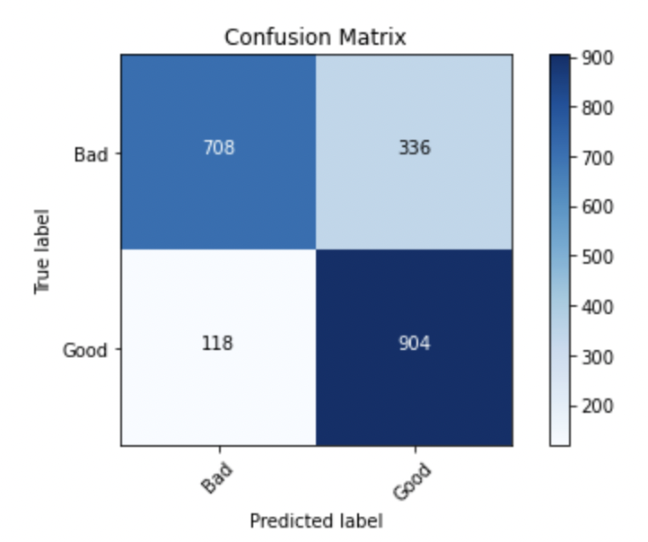

# Deep learning - Wine Quality challenge

# Mission
Create an AI model to predict the quality of a wine. By using an AI model, we would reduce the risk of bias, usually associated with wine tasting.

# Goal
* Use a deep learning library
* Prepare a data set for a machine learning model
* Put together a simple neural network
* Tune parameters of a neural network

# Installation
### Python version
* Python 3.9

### Packages used
* pandas
* matplotlib
* seaborn
* sklearn
* tensorflow

# Usage
### Main folder
| File           | Description                                                 |
|-------------------|-------------------------------------------------------------|
| wine_quality.ipynb        | Main file containing the cleaning, creation of the different models, and visuals. |
| wine.csv      | Original csv file with information about wines |
| Visuals           | Directory containing images             |

# Project
## Project evolution

## Intro
* All models are Sequentials and used Dense layers
* Always Relu as activation function, except the output layer with Sigmoid

## v0 (Baseline)
* No manipulation of data
* Separation of 'bad'(quality < 6) and 'good' (quality >= 6) wines
* Great unbalance of bad (2384) and good (4113) wines
* Overfitting
* Learning rate = .0001
* 2 hidden layers (20, 10)
* Validation split = .1
* Batch size = 10
* Epochs = 30

|    | Loss      | Accuracy | Val Loss | Val Accuracy | Test Accuracy |
| -- | --------- | ------   | -------- | ------------ | ------------- |
| v0 | .56       | .69      | .55      | .70          | .71           |

## v3 (Final)
* Separation of 'bad'(quality < 7) and 'good' (quality >= 7) wines
* Great balance of bad (5108) and good (5220) wines
* 4 hidden layers (30, 30, 20, 10)
* Learning rate = .001
* Validation split = .1
* Batch size = 25
* Epochs = 300
* Early stopping used to prevent overfitting

|    | Loss      | Accuracy | Val Loss | Val Accuracy | Test Accuracy |
| -- | --------- | ------   | -------- | ------------ | ------------- |
| v3 | .56       | .69      | .55      | .70          | .71           |

# Remarks
* Lower results with normalizing the data, so kept the data as it is
* Tried feature engineering by adding the type of wine (red or white) and creating a sulfate ratio, but it didn't improve the model.
* Random Forest model has very high accuracy (0.96) on this dataset

# Timeline
07/09/2021 - 09/09/2021